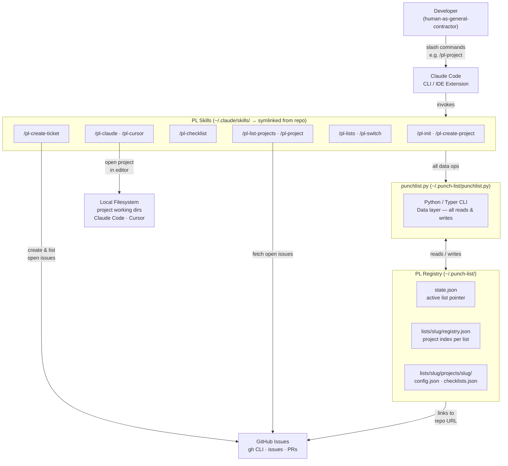

# Punch List

Agentic workflow coordination that organizes all your projects and keeps you in flow by eliminating context-switching overhead. A super lightweight skill set that enables Claude and other skills to actually help you get work done across ALL your projects.

---

## Dependencies

| Dependency | Required for | Notes |
|------------|-------------|-------|
| [Claude Code](https://claude.ai/code) CLI | All skills | The runtime that executes every `/pl-*` command |
| [`gh` CLI](https://cli.github.com/) (authenticated) | `pl-project`, `pl-create-ticket` | GitHub Issues — open issue lookup and issue creation |
| [`cursor`](https://www.cursor.com/) CLI on PATH | `pl-cursor` | Opens projects in the Cursor editor |
| Python 3 | All skills | Required to run `punchlist.py` — the data layer CLI (bundled, no install needed) |

---

## Quick Start

```bash
git clone https://github.com/shuskey/punch-list.git
cd punch-list
```

**macOS / Linux:**
```bash
./install-skills.sh
```

**Windows (PowerShell):**
```powershell
.\install-skills.ps1
```

### Development Mode Install

Both installers create **symbolic links** (symlinks on Mac/Linux, directory junctions on Windows) from `~/.claude/skills/` back to the repo. This means edits to `punch-list/skills/` take effect instantly — no reinstall needed. This is the recommended setup when developing, modifying, or improving skills.

> In the future, a published marketplace install will be available for users who just want to use the skills without a local repo clone. These installers are the **development mode** path.

Once installed, start with `/pl-init` in any Claude Code session.

---

## Vision

Punch List gives every project a home — a single card that knows its state, its artifacts, and what's next. The board is built around a **human-as-general-contractor** model: you break ground, agents do the work, and you decide what gets signed off, sent back, or mothballed.

---

## The Seven States (A–G) of the lifecycle

A project typically progresses through each of these states. But since you are the general contractor, you can decide which ones to skip and when to return back to a previous state for a rework.
Future skills or skill add-ons will assist in the transition from one state to another, ensuring that state has been completed and helping to providing what's needed for the next state.

| # | State | Mnemonic | GC Phase |
|---|-------|----------|----------|
| A | Ideation | Aspiring | Napkin Sketch |
| B | Defining | Building | Blueprint |
| C | Proving | Crystallizing | Feasibility Study |
| D | Delivering | Dispatching | Framing |
| E | Evolving | Elevating | Finishing Work |
| F | Sustaining | Fortifying | Occupied |
| G | Sunsetting | Graduating | Demolition Permit |

**G — Sunsetting is the only true exit.** Nothing disappears passively — Sunsetting is an intentional decision.

---

## Punch List — The Project Registry

A lightweight personal project registry that lives at `~/.punch-list/` and serves as the connective tissue between GitHub, your local filesystem, and Claude.

### Registry Structure

```
~/.punch-list/
  state.json                             # Active list pointer and list index
  punchlist.py                           # Data layer CLI (Python/Typer)
  lists/
    <list-slug>/
      registry.json                      # Project index for this list
      projects/
        <slug>/
          config.json                    # Per-project metadata
          checklists.json                # Checklists for this project (if any)
```

### Project Config Fields

Each project card stores:

| Field | Purpose |
|-------|---------|
| `name` / `slug` | Identity |
| `state` | A–G lifecycle state |
| `description` | What this project is |
| `githubRepo` | GitHub repo URL — issues on this repo are the project's tickets |
| `githubVisibility` | `public`, `private`, or `null` |
| `subDirectory` | Subdirectory within a monorepo |
| `localDirectory` | Local filesystem path |
| `nextStep` | The single most important next action |
| `updateNotes` | Free-form notes on where work was left off and what's next |

---

## PL Skills

Punch List ships as a set of Claude Code skills. Install them via `install-skills.sh` (Mac/Linux) or `install-skills.ps1` (Windows).

| Skill | Invoke | What it does |
|-------|--------|-------------|
| `pl-init` | `/pl-init` | Initialize Punch List, create `~/.punch-list/` registry |
| `pl-create-project` | `/pl-create-project` | Interactively create a new project card |
| `pl-list-projects` | `/pl-list-projects` | Display all projects grouped by state |
| `pl-project` | `/pl-project <slug>` | Show full detail card for a single project |
| `pl-checklist` | `/pl-checklist [slug]` | Manage checklists for a project |
| `pl-create-ticket` | `/pl-create-ticket` | Create a GitHub issue on the project's repo |
| `pl-lists` | `/pl-lists` | Create, switch, rename, or delete Punch Lists |
| `pl-switch` | `/pl-switch <name>` | Shortcut to switch the active Punch List |
| `pl-claude` | `/pl-claude <slug>` | Launch Claude Code at the project's local directory |
| `pl-cursor` | `/pl-cursor <slug>` | Launch Cursor at the project's local directory |

### Example Board:

```
Punch List: Photoloom - Scott Huskey Engineering — 6 projects     Checklists  GitHub  Local

[A] Ideation
   Cobweb Sweeper                                                               no      no

[B] Defining
   Ticket/Issue Processor                                                        no     yes
   QA Skill Development                                                          no      no

[D] Delivering
👉 Punch List                                                       1 checklist  🌐     yes
    → Push to GitHub and update marketplace listing.
   Automated UI Testing                                                           🔒    yes

[G] Sunsetting
   EOL Tests in the mono repo                                                     🔒    yes
```

---

## Technical Architecture

How the system components connect at runtime:



> The `.drawio` source is at [`assets/architecture.drawio`](assets/architecture.drawio) for editing in draw.io.
